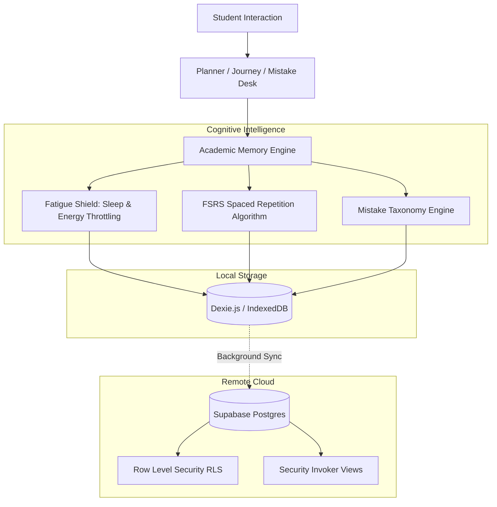

# Orbit — Adaptive Academic Operating System

> **An intelligent, local-first Academic OS for STEM/JEE and College CS/AI-ML students.**  
> Orbit closes the loop between daily study sessions, error logging, cognitive fatigue protection, and long-term memory retention.

---

## 🏛 System Architecture

Orbit is engineered with a **dual-layer, local-first architecture**. It pairs zero-latency offline client state (IndexedDB via Dexie.js) with real-time multi-device cloud synchronization and relational integrity (PostgreSQL via Supabase).

```
                      ┌─────────────────────────────────────────┐
                      │          USER / CLIENT SURFACE          │
                      │    Next.js 14 (App Router) + PWA UI     │
                      └────────────────────┬────────────────────┘
                                           │
                                           ▼
      ┌─────────────────────────────────────────────────────────────────────────┐
      │                    UNIFIED ACADEMIC MEMORY ENGINE                       │
      │                     (src/lib/academicState.ts)                          │
      ├────────────────────────────────────┬────────────────────────────────────┤
      │                                    │                                    │
      ▼                                    ▼                                    ▼
┌───────────────┐                  ┌───────────────┐                  ┌───────────────────┐
│ FATIGUE SHIELD│                  │ FSRS RETENTION│                  │  ERROR TAXONOMY   │
│ & CAPACITY    │                  │    ENGINE     │                  │  & AUTO-REVISION  │
│ (Sleep/Energy)│                  │(SM-2 Adaptive)│                  │ (Root-cause Tag)  │
└───────┬───────┘                  └───────┬───────┘                  └─────────┬─────────┘
        │                                  │                                    │
        └──────────────────────────────────┼────────────────────────────────────┘
                                           │
                                           ▼
                    ┌──────────────────────────────────────────────┐
                    │            DUAL PERSISTENCE LAYER            │
                    ├──────────────────────────────┬───────────────┤
                    │   LOCAL-FIRST (0ms Latency)  │  CLOUD SYNC   │
                    │      IndexedDB / Dexie       │   Supabase    │
                    │      ('OrbitStudyOS')        │  (Postgres)   │
                    └──────────────────────────────┴───────────────┘
```

### Detailed Component Flow



---

## ⚡ Core Innovations & Features

### 1. Unified Academic Memory Engine (`src/lib/academicState.ts`)
Consolidates student velocity, active backlogs, mistake taxonomies (conceptual vs. calculation), target exam proximity, and energy profiles into a single reactive state representation.

### 2. Cognitive Capacity & Fatigue Shield (`src/lib/planningEngine.ts`)
* Automatically monitors sleep duration and energy scores.
* When sleep is $< 6.0\text{ h}$ or energy score $\le 2/5$:
  * **Throttles tactical load** by capping total daily hours to $4.0\text{ h}$.
  * **Filters out high-strain problem sets** and complex conceptual tasks.
  * **Prioritizes low-friction active recall** and light revision to prevent cognitive burnout.

### 3. FSRS Adaptive Spaced Repetition (`src/lib/spacedRepetition.ts`)
* Enhanced SM-2 / Free Spaced Repetition Scheduler.
* Dynamically calculates recall stability, difficulty factors, and optimal review intervals:
  $$\text{Interval}_{\text{next}} = \text{Interval}_{\text{prev}} \times \text{Ease Factor} \times \text{Grade Multiplier}$$
* **Error Backlog Dampening:** If a chapter has high unaddressed mistake density, review intervals are automatically compressed to reinforce fragile neural pathways.
* Features an **in-place 3-grade recall chamber** (`Again`, `Hard`, `Good`) directly on the Planner desk.

### 4. Closed-Loop Mistake Book (`src/api/mistakes.ts`)
* Classifies errors into rigorous cognitive categories: `Conceptual`, `Calculation`, `Careless`, `Application`, or `Time Management`.
* Automatically enrolls the underlying syllabus chapter into the spaced repetition queue upon logging an error.

### 5. Multi-Curriculum Tracks
Pre-configured, out-of-the-box syllabus taxonomies:
* **JEE / NSEP Track:** Physics, Chemistry, Mathematics with JEE exam weightage tiers (High, Medium, Low).
* **College CS & AI-ML Track:** Data Structures & Algorithms, Machine Learning & Deep Learning, Database Management Systems, Operating Systems & Networks.

---

## 🗄️ Database Architecture (Supabase Postgres)

The backend runs on Supabase PostgreSQL with strict Row Level Security (RLS) policies and idempotent setup:

* **`profile`** — User metadata, target exams, sleep and energy preferences.
* **`subject`** — Academic disciplines partitioned by track (`jee_nsep`, `college_cs_aiml`).
* **`chapter`** — Complete syllabus chapters with exam weightage indicators.
* **`user_chapter_progress`** — Personal mastery percentage, confidence score, and status lifecycle.
* **`task`** — Daily atomic tasks with estimated minutes, priority, and energy cost.
* **`study_session`** — Focus sessions with duration analytics.
* **`mistake`** — Logged errors with root cause tagging, photo attachments, and resolution status.
* **`revision`** — Spaced repetition schedule with stability, ease factors, and review counts.
* **`reflection`** — Evening check-ins, fatigue logging, and qualitative notes.
* **`event_log`** — Append-only behavioral event stream for deep work analytics.
* **`exam` & `exam_chapter`** — Mock tests and upcoming milestones mapped to syllabus coverage.

### Pre-computed Performance Views
1. **`my_chapter_status`** — Dynamic chapter-level progress, mistake counts, and revision due dates.
2. **`my_subject_progress`** — Subject-level completion percentage and confidence distribution.
3. **`my_exam_readiness`** — Holistic syllabus readiness score weighted by exam blueprint.

---

## 🚀 Quickstart & Setup

### Prerequisites
* **Node.js LTS** (v18 or v20 recommended)
* A free **[Supabase](https://supabase.com)** account
* A free **[Vercel](https://vercel.com)** account (for production deployment)

### 1. Database Initialization (1-Click)
1. In your Supabase Project dashboard, navigate to the **SQL Editor**.
2. Open **`supabase/complete_orbit_database.sql`** from this repository.
3. Paste and run the entire script. It is **100% idempotent** and will:
   * Create all 12 tables and constraints.
   * Enable Row Level Security (RLS) with self-ownership policies.
   * Configure auth triggers for automatic user onboarding.
   * Seed all 7 curriculum subjects and 49 core syllabus chapters.

### 2. Configure Environment Variables
Copy `.env.example` to `.env.local`:
```bash
cp .env.example .env.local
```

Fill in your project credentials (found in Supabase Dashboard → Settings → API):
```env
NEXT_PUBLIC_SUPABASE_URL=https://your-project-id.supabase.co
NEXT_PUBLIC_SUPABASE_ANON_KEY=your-anon-public-key
```

> [!CAUTION]
> The `NEXT_PUBLIC_SUPABASE_URL` must be the bare URL (e.g. `https://xxxx.supabase.co`). Do not append `/rest/v1/`.

### 3. Install & Run Locally
```bash
# Install dependencies
npm install

# Start development server
npm run dev

# Run production build validation
npm run build
```
Open **[http://localhost:3000](http://localhost:3000)** in your browser.

---

## 📱 Progressive Web App (PWA)

Orbit is built as an installable PWA with offline caching:
* **iOS (Safari):** Tap **Share** → **Add to Home Screen**.
* **Android (Chrome):** Tap **Install Orbit** from the browser prompt.
* **Desktop (Chrome/Edge):** Click the **Install** icon in the address bar.

---

## 🌐 Production Deployment (Vercel)

1. Push your code to your GitHub repository:
   ```bash
   git push origin main
   ```
2. In [Vercel](https://vercel.com), import your repository.
3. Add the following **Environment Variables** in Project Settings:
   * `NEXT_PUBLIC_SUPABASE_URL`
   * `NEXT_PUBLIC_SUPABASE_ANON_KEY`
4. Click **Deploy**. Vercel will output your production URL.

---

## 📁 Repository Structure

```
├── src/
│   ├── api/               # Domain-specific Supabase & Dexie persistence drivers
│   │   ├── chapters.ts
│   │   ├── events.ts
│   │   ├── exams.ts
│   │   ├── gamification.ts
│   │   ├── journey.ts
│   │   ├── mistakes.ts    # Error logging + auto-spaced repetition trigger
│   │   ├── profile.ts
│   │   ├── revisions.ts   # Local-first Dexie spaced repetition queues
│   │   ├── study_sessions.ts
│   │   └── tasks.ts
│   ├── app/               # Next.js App Router pages
│   │   ├── journey/       # Interactive syllabus tree
│   │   ├── login/         # Supabase Auth
│   │   ├── mistakes/      # Mistake Book with error taxonomy
│   │   ├── planner/       # Tactical cockpit & recall chamber
│   │   ├── profile/       # Energy, sleep & account settings
│   │   └── week/          # 7-day tactical load & exam radar
│   ├── components/        # Reusable design system & desk widgets
│   │   ├── AiMentorCard.tsx
│   │   ├── CalibratePlanModal.tsx
│   │   ├── RevisionSession.tsx
│   │   └── ...
│   ├── db/
│   │   └── client.ts      # Dexie.js IndexedDB schema ('OrbitStudyOS')
│   └── lib/               # Intelligence engines
│       ├── academicState.ts   # Unified Academic Memory State
│       ├── planningEngine.ts  # Capacity & Fatigue Shield
│       ├── spacedRepetition.ts# FSRS / SM-2 algorithm
│       └── supabase.ts    # Supabase Client singleton
├── supabase/
│   └── complete_orbit_database.sql # Consolidated 1-click master schema
└── public/                # Static assets, icons, manifest.json
```

---

## 📄 License
MIT License. Built for dedicated STEM and Computer Science students.
