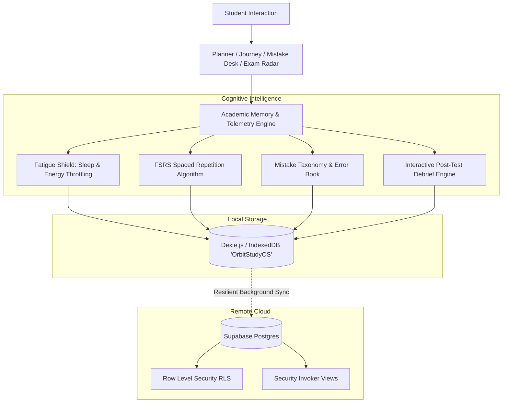

# Orbit — Adaptive Academic Operating System

> **An intelligent, local-first Academic OS for STEM/JEE and College CS/AI-ML scholars.**  
> Orbit closes the loop between daily study sessions, error logging, post-test diagnostic debriefs, cognitive fatigue protection, and long-term memory retention.

---

## 📚 Official User Guide & Architecture
Complete tab-by-tab walkthrough, architectural audit, and manual:
* 📝 **[Read Master Markdown Guide (`orbit_guide.md`)](./orbit_guide.md)** — Comprehensive 5-page guide to every tab, feature, and workflow.
* 📄 **[Download Official Master PDF (`orbit_guide.pdf`)](./orbit_guide.pdf)** — Publication-grade A4 executive manual.
* 🏛 **[Architectural Audit & Roadmap (`orbit_v2_architectural_audit.md`)](./orbit_v2_architectural_audit.md)** — In-depth architectural blueprint and technical design decisions.

---

## 🏛 System Architecture

Orbit is engineered with a **dual-layer, local-first architecture**. It pairs zero-latency client state (IndexedDB via Dexie.js) with real-time multi-device cloud synchronization and relational integrity (PostgreSQL via Supabase).

```
                      ┌─────────────────────────────────────────┐
                      │          USER / CLIENT SURFACE          │
                      │    Next.js 14 (App Router) + PWA UI     │
                      └────────────────────┬────────────────────┘
                                           │
                                           ▼
      ┌─────────────────────────────────────────────────────────────────────────┐
      │                    UNIFIED ACADEMIC MEMORY ENGINE                       │
      │                     (src/lib/academicState.ts)                          │
      ├────────────────────┬────────────────────┬───────────────────────────────┤
      │                    │                    │                               │
      ▼                    ▼                    ▼                               ▼
┌───────────────┐  ┌───────────────┐  ┌───────────────────┐           ┌───────────────────┐
│ FATIGUE SHIELD│  │ FSRS RETENTION│  │  ERROR TAXONOMY   │           │ POST-TEST DEBRIEF │
│ & CAPACITY    │  │    ENGINE     │  │  & AUTO-REVISION  │           │ & EXAM ANALYTICS  │
│ (Sleep/Energy)│  │(SM-2 Adaptive)│  │ (Root-cause Tag)  │           │(Subject Breakdown)│
└───────┬───────┘  └───────┬───────┘  └─────────┬─────────┘           └─────────┬─────────┘
        │                  │                    │                               │
        └──────────────────┴────────────────────┼───────────────────────────────┘
                                                │
                                                ▼
                     ┌──────────────────────────────────────────────┐
                     │            DUAL PERSISTENCE LAYER            │
                     ├──────────────────────────────┬───────────────┤
                     │   LOCAL-FIRST (0ms Latency)  │  CLOUD SYNC   │
                     │      IndexedDB / Dexie       │   Supabase    │
                     │      ('OrbitStudyOS')        │  (Postgres)   │
                     └──────────────────────────────┴───────────────┘
```

### Detailed Component Flow



---

## ⚡ Core Innovations & Features

### 1. Unified Academic Memory Engine (`src/lib/academicState.ts`)
Consolidates student study velocity, active backlogs, mistake taxonomies (conceptual vs. calculation), target exam proximity, and energy profiles into a single reactive state representation with zero UI blocking.

### 2. Interactive Post-Test Micro-Debrief Engine (`src/components/TestDebriefModal.tsx`, `src/api/testAttempts.ts`)
* **3-Step Micro-Debrief:** Automatically triggers when completing a mock task or via the Exam Card debrief action button.
* **Single vs. Multi-Subject Adaptability:** Automatically adapts to single-discipline tests (e.g. COA Midsem, Organic Chemistry test) or composite multi-subject exams (e.g. JEE Main, Advanced).
* **Accurate Syllabus Alignment:** Only displays the exact subjects and chapters selected during test creation.
* **Deep Error Diagnosis:** Captures paper difficulty (*Easy, Balanced, Crushing*), fumble factor (*Concept blindspot, Time panic, Calculation slips, In control*), and relative difficulty vs. peers.
* **Closed-Loop Mistake Linkage:** Directly links leaked chapters into the Mistake Vault for automated spaced review enrollment.
* **Unfiltered Reflection Space:** Dedicated student notes area for honest qualitative insights.

### 3. Cognitive Capacity & Fatigue Shield (`src/lib/planningEngine.ts`)
* Monitors sleep duration and subjective energy ratings.
* When sleep is $< 6.0\text{ h}$ or energy score $\le 2/5$:
  * **Throttles tactical load** by capping total daily hours to $4.0\text{ h}$.
  * **Filters out high-strain problem sets** and complex conceptual tasks.
  * **Prioritizes low-friction active recall** and light revision to prevent cognitive burnout.

### 4. FSRS Adaptive Spaced Repetition (`src/lib/spacedRepetition.ts`)
* Enhanced SM-2 / Free Spaced Repetition Scheduler.
* Dynamically calculates recall stability, difficulty factors, and optimal review intervals:
  $$\text{Interval}_{\text{next}} = \text{Interval}_{\text{prev}} \times \text{Ease Factor} \times \text{Grade Multiplier}$$
* **Error Backlog Dampening:** If a chapter has high unaddressed mistake density, review intervals are automatically compressed to reinforce fragile neural pathways.
* Features an **in-place 3-grade recall chamber** (`Again`, `Hard`, `Good`) directly on the Planner desk.

### 5. Universal Streak Accuracy & Offline-First Engine (`src/api/gamification.ts`)
* **Multi-Signal Streak Continuity:** Both `scheduled_date` and `completed_at` timestamps contribute to daily completion sets, ensuring streaks (4-day, 10-day, 30-day+) never collapse from batch-completion or timezone shifts.
* **Holistic Study Recognition:** Spaced repetition revisions and mock test attempts also count towards daily streak continuity.
* **Non-Destructive Local Sync:** Background sync never purges local tasks from Dexie IndexedDB, guaranteeing 100% offline data safety.
* **Schema Fallbacks:** Cloud mutations automatically fall back to standard core schemas if remote databases have not yet run extended telemetry migrations.

### 6. Subject-First Exam Planner & Editor (`src/components/AddExamModal.tsx`, `src/components/EditExamModal.tsx`)
* **Progressive Disclosure:** First enter the exam title, then pick participating subjects with clean clickable badges, and finally select chapters organized in a tabbed syllabus view.
* **Eliminates Clutter:** Guarantees that coaching tests, contests, and semester exams only show syllabus chapters relevant to their chosen subjects.

### 7. Closed-Loop Mistake Book (`src/api/mistakes.ts`)
* Classifies errors into rigorous cognitive categories: `Conceptual`, `Calculation`, `Careless`, `Application`, or `Time Management`.
* Automatically enrolls the underlying syllabus chapter into the spaced repetition queue upon logging an error.

### 8. Onboarding Track Lock-In & Isolation
* Academic focus track is selected **once during account signup**:
  * **STEM & Olympiad Track:** Physics, Chemistry, and Mathematics calibrated to JEE Main, Advanced, and NSEP.
  * **College CS & AI-ML Track:** Data Structures & Algorithms, Machine Learning & Deep Learning, Web Systems, and Core Computer Science.
* **Locked Inside the App:** Track selection controls are permanently removed from inside the application to prevent syllabus desync.

### 9. Behavioral Telemetry & DPDP Compliance (`src/lib/telemetry.ts`, `src/api/events.ts`)
* Offline-first outbox in Dexie (`db.events`) with automatic cloud flush.
* Enriches events with slot drift (planned morning vs. executed night), date drift, advance planning ratio, and focus duration.
* Full India Digital Personal Data Protection (DPDP) Act compliance with privacy disclosure and guest data self-containment.

### 10. AI Mentor Context Contract (`src/lib/aiMentorContext.ts`)
* Generates a deterministic, structured `AiMentorContext` JSON snapshot consolidating student habits, subject breakdown scores, fatigue history, and recent test debriefs for future LLM mentor integrations.

### 11. Drift-Proof Focus Engine & Screen WakeLock API (`src/components/FocusTimerModal.tsx`)
* **Timestamp-Delta Precision:** Uses real system timestamp deltas ($\Delta t = \text{Date.now()} - t_{\text{start}}$), immune to mobile background tab throttling.
* **Page Visibility API:** Syncs elapsed seconds immediately upon returning to the tab.
* **W3C Screen WakeLock:** Keeps the mobile display active during deep work sessions, auto-releasing upon pause or completion.

---

## 🗄️ Database Architecture (Supabase Postgres)

The backend runs on Supabase PostgreSQL with strict Row Level Security (RLS) policies and idempotent setup:

* **`profile`** — User metadata, display name, target exams, sleep and energy preferences.
* **`subject`** — Academic disciplines partitioned by track (`jee_nsep`, `college_cs_aiml`).
* **`chapter`** — Complete syllabus chapters with subject foreign keys.
* **`user_chapter_progress`** — Personal mastery percentage, confidence score, and status lifecycle.
* **`task`** — Daily atomic tasks with estimated minutes, priority, time slots, and completion tracking.
* **`study_session`** — Focus sessions with duration analytics.
* **`mistake`** — Logged errors with root cause tagging, difficulty, and resolution status.
* **`revision`** — Spaced repetition schedule with intervals, ease factors, and review counts.
* **`reflection`** — Evening check-ins, fatigue logging, sleep hours, and qualitative notes.
* **`event_log`** — Append-only behavioral event stream for deep work analytics.
* **`exam` & `exam_chapter`** — Mock tests and milestones mapped to syllabus coverage.
* **`test_attempts` (Dexie Local & Event Stream)** — Rich exam attempt debriefs with subject breakdowns and student reflections.

---

## 🚀 Quickstart & Setup

### Prerequisites
* **Node.js LTS** (v18 or v20 recommended)
* A free **[Supabase](https://supabase.com)** account
* A free **[Vercel](https://vercel.com)** account (for production deployment)

### 1. Database Initialization (1-Click)
1. In your Supabase Project dashboard, navigate to the **SQL Editor**.
2. Open **`supabase/complete_orbit_database.sql`** from this repository.
3. Paste and run the entire script. It is **100% idempotent** and will:
   * Create all core tables, constraints, and indexes.
   * Enable Row Level Security (RLS) with self-ownership policies.
   * Configure auth triggers for automatic user onboarding.
   * Seed standard curriculum subjects and syllabus chapters.

### 2. Configure Environment Variables
Copy `.env.example` to `.env.local`:
```bash
cp .env.example .env.local
```

Fill in your project credentials (found in Supabase Dashboard → Settings → API):
```env
NEXT_PUBLIC_SUPABASE_URL=https://your-project-id.supabase.co
NEXT_PUBLIC_SUPABASE_ANON_KEY=your-anon-public-key
```

### 3. Install & Run Locally
```bash
# Install dependencies
npm install

# Start development server
npm run dev

# Run production build validation
npm run build
```
Open **[http://localhost:3000](http://localhost:3000)** in your browser.

---

## 📱 Progressive Web App (PWA)

Orbit is built as an installable PWA with full offline capabilities:
* **iOS (Safari):** Tap **Share** → **Add to Home Screen**.
* **Android (Chrome):** Tap **Install Orbit** from the browser prompt.
* **Desktop (Chrome/Edge):** Click the **Install** icon in the address bar.

---

## 📁 Repository Structure

```
├── src/
│   ├── api/               # Supabase & Dexie persistence drivers
│   │   ├── chapters.ts
│   │   ├── events.ts      # Offline-first behavioral telemetry outbox
│   │   ├── exams.ts       # Milestone & exam management
│   │   ├── gamification.ts# Streak & XP leveling engine
│   │   ├── journey.ts     # Syllabus tree & chapter dossier
│   │   ├── mistakes.ts    # Error logging + auto-spaced repetition trigger
│   │   ├── profile.ts
│   │   ├── reflection.ts  # Daily reflection & fatigue check-in
│   │   ├── revisions.ts   # Spaced repetition queues
│   │   ├── study_sessions.ts
│   │   ├── tasks.ts       # Task CRUD, status updates & cloud sync
│   │   └── testAttempts.ts# Post-test debrief recording & mistake linkage
│   ├── app/               # Next.js App Router pages
│   │   ├── journey/       # Interactive syllabus tree & chapter dossiers
│   │   ├── login/         # Supabase Auth with track lock-in
│   │   ├── mistakes/      # Mistake Book with error taxonomy
│   │   ├── planner/       # Tactical cockpit & recall chamber
│   │   ├── profile/       # Energy, sleep, account settings & JSON backup
│   │   └── week/          # 7-day tactical load, exams & test debriefs
│   ├── components/        # Reusable design system & desk widgets
│   │   ├── AddExamModal.tsx      # Subject-first exam creation
│   │   ├── EditExamModal.tsx     # Tabbed syllabus exam editing
│   │   ├── TestDebriefModal.tsx  # 3-step post-test micro-debrief
│   │   ├── FocusTimerModal.tsx   # Drift-proof timer with WakeLock
│   │   ├── CalibratePlanModal.tsx# Anti-burnout auto-calibration
│   │   └── ...
│   ├── lib/               # Intelligence engines & sync utilities
│   │   ├── academicState.ts   # Unified Academic Memory State
│   │   ├── aiMentorContext.ts # Structured AI Mentor payload builder
│   │   ├── curriculumData.ts  # Curriculum taxonomy & ID resolvers
│   │   ├── db.ts              # Dexie.js IndexedDB schema ('OrbitStudyOS')
│   │   ├── habitEngine.ts     # Temporal habit & slot analysis
│   │   ├── planningEngine.ts  # Capacity & Fatigue Shield
│   │   ├── spacedRepetition.ts# FSRS / SM-2 algorithm
│   │   ├── syncService.ts     # Non-destructive cloud sync engine
│   │   ├── telemetry.ts       # Slot drift & advance planning telemetry
│   │   └── uuid.ts            # RFC 4122 v4 UUID generator & validator
│   └── supabase/
│       └── complete_orbit_database.sql # Master idempotent SQL schema
└── public/                # Static assets, icons, manifest.json
```

---

## 📄 License
MIT License. Built for dedicated STEM and Computer Science scholars.
