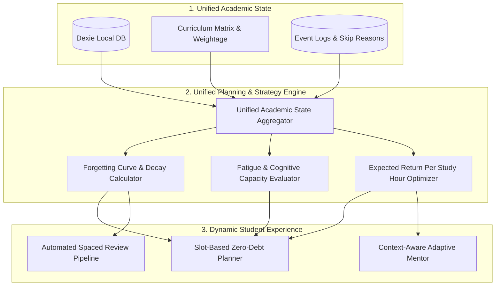

# Orbit v2 Architectural Audit & "Academic OS" Roadmap

**System**: Orbit Web v2  
**Philosophy**: *"Plan Less. Optimize Learning. Stay in Orbit."*  
**Scope**: End-to-end evaluation of data structures, planning algorithms, local-first state, and cognitive feedback loops.

---

## 1. Executive Summary

Orbit v2 is **not** a blank MVP. It already features a sophisticated, responsive Next.js 14 architecture with local-first IndexedDB (Dexie), cloud synchronization (Supabase SSR), multi-track support (JEE/NSEP & College CS/AI-ML), mandatory skip-reasoning, mistake logging, focus timers, and a deterministic planning engine.

However, the application currently functions as a set of **loosely coupled modules** rather than a unified **Academic Operating System**:

```
Current Orbit v2 (Fragmented Feedback):
[Tasks / Planner] ──(writes)──> Dexie / Supabase
[Mistake Book]    ──(writes)──> Dexie / Supabase
[Reflection]      ──(writes)──> Dexie / Supabase
[Exams]           ──(writes)──> Dexie / Supabase
       ▲
       │ (Disconnected)
[Planning Engine] ◄─── Reads STATIC starter arrays (curriculumData.ts), NOT live user Dexie state!
```

To deliver on the vision of an adaptive learning system that **prevents burnout, optimizes high-yield study hours, and eliminates planning debt**, Orbit needs to transition to a closed-loop **Academic Memory & Planning Engine**.

---

## 2. In-Depth Component Audit

### A. Planning Engine (`src/lib/planningEngine.ts`)

| Feature | Current Implementation | Gap vs. Academic OS Vision |
| :--- | :--- | :--- |
| **Data Source** | Reads `getCurriculumChapters(input.track)` directly from hardcoded curriculum data. | Ignores the user's actual live Dexie progress, custom chapters, real mistake tallies, and overridden confidence scores. |
| **Priority Formula** | `score = (mistakeWeight + confidenceGap + revisionBoost) * examUrgency` | Promising foundation, but lacks chapter **exam weightage** (JEE/NSEP marks distribution) and **prerequisite chains** (e.g. Calculus before Mechanics). |
| **Energy & Capacity** | Multipliers: `1 -> 0.6`, `2 -> 0.75`, `3 -> 0.9`, `4+ -> 1.0` on base hours. | Input `energyLevel` and `availableHours` are hardcoded in the UI (`energyLevel: 4`, `availableHours: 4.5`) instead of dynamically inferred from the student's recent daily reflections or calendar load. |
| **Slot Allocation** | Morning (hard problem), Afternoon (secondary), Evening (spaced rev), Night (flashcard/review). | Fixed cognitive slot mapping is sound, but tasks are generated as ephemeral proposals and lack two-way synchronization with due revisions in `db.revisions`. |

---

### B. Structured Academic Memory & Offline Storage (`src/lib/db.ts`)

| Area | Current Implementation | Audit Findings & Recommendations |
| :--- | :--- | :--- |
| **Dexie Schema** | Tables for `tasks`, `mistakes`, `revisions`, `exams`, `progress`, `reflections`, `events`. | Well-designed schema with multi-field indexes (`[user_id+chapter_id]`, `[user_id+day]`). |
| **Hybrid Persistence** | Local-first reads with background async Supabase write. Fast fallbacks with `Promise.race` timeouts (800ms). | **Critical Issue**: Custom subjects/chapters and confidence overrides are written to `localStorage` (`orbit_custom_subjects`, `orbit_chapter_overrides`) instead of the Dexie `progress` table, causing state fragmentation between Journey and Planner. |
| **Data Recovery** | Full JSON snapshot export and import (`exportOrbitBackupJSON`). | Production-ready backup mechanism. Protects user data even during local development resets. |

---

### C. Mistake Book & Error Taxonomies (`src/api/mistakes.ts`, `src/app/mistakes/page.tsx`)

| Aspect | Current Status | Audit Evaluation |
| :--- | :--- | :--- |
| **Taxonomy** | Rich categorization: `conceptual`, `calculation`, `silly`, `time_pressure`, `misread_question`, `tle`, `corner_case`, `logic_flaw`, `memory_oom`. | **Strongest subsystem in Orbit.** Perfectly tailored to STEM/JEE Olympiads and Computer Science. |
| **Difficulty Rating** | `easy`, `medium`, `hard`. | Stored and displayed accurately. |
| **Engine Linkage** | Only counts *unresolved mistake count*. | **Missing Distinction**: A `conceptual` mistake should trigger a deep-work study block, whereas a `calculation` or `time_pressure` mistake should trigger a timed 10-question sprint. |

---

### D. Spaced Revision System (`src/api/revisions.ts`)

| Feature | Current State | Target State |
| :--- | :--- | :--- |
| **Interval Ladder** | Fixed sequence: `[1, 3, 7, 16, 35]` days. | **FSRS / SM-2 Adaptive Algorithm**: Adjust intervals based on difficulty, review history, and performance grade (Failed, Hard, Good, Easy). |
| **Mistake Penalty** | Halves interval if `unresolvedMistakes >= 3`. | Good heuristic, but needs to be triggered upon mistake creation rather than only upon manual review completion. |
| **Queue Integration** | Revisions are viewed in `/mistakes` under a tab. | Due revisions must automatically inject into the daily planner's **Evening Slot** as first-class missions. |

---

### E. AI Mentor & Adaptive Feedback (`src/components/AiMentorCard.tsx`)

| Component | Current Reality | Architectural Solution |
| :--- | :--- | :--- |
| **Guidance Generation** | Static strings conditioned on `track === 'jee_nsep'`. Canned accordion Q&As. | Replace hardcoded text with an **Adaptive Strategy Evaluator** that computes insights from real analytics (e.g., skip patterns, sleep vs. completion correlations). |
| **One-Tap Auto-Calibrate** | Generates plan in modal; applies proposed tasks into today's schedule. | **High Value Feature**: Once re-wired to real Dexie state, this becomes Orbit's killer capability. |

---

## 3. The 4 Structural Gaps to Bridge



### Gap 1: State Disconnect (Live Dexie vs. Static Seeds)
The Planning Engine must ingest live user data from Dexie:
- User-specific chapter confidence scores (`db.progress`)
- Live unresolved mistakes grouped by chapter and error type (`db.mistakes`)
- Next active exam date and targeted chapters (`db.exams`)
- Last 3 days' average sleep and energy rating (`db.reflections`)

### Gap 2: ROI-Based Optimization (Expected Return per Study Hour)
Priority score should balance:
$$\text{Score} = \left( W_{\text{exam}} \times \Delta_{\text{confidence}} \times \text{Urgency}(days) \right) + \text{Penalty}_{\text{mistakes}} + \text{Decay}_{\text{forgetting}}$$
- **High Weight + Low Confidence = High ROI** (immediate priority).
- **Mastered Chapter + Approaching Forgetting Curve = Quick Spaced Review** (preservation priority).

### Gap 3: Burnout & Overload Protection (Cognitive Capacity Physics)
Instead of forcing fixed 4.5-hour quotas:
- If a student logged `sleep_hours < 6` or `energy_rating <= 2`, cap daily planned focus minutes to $\le 180$ minutes and downgrade task cognitive difficulty from `high` to `medium`/`low`.
- If a student has logged `coaching_overran` 3 days this week, reserve weekdays for 1 high-priority drill + revisions, saving heavy multi-hour concept work for the weekend.

### Gap 4: Spaced Revision Pipeline Closure
Due revisions in `db.revisions` must automatically show up as suggested tasks in the evening slot without requiring manual task creation.

---

## 4. Phase-by-Phase Implementation Roadmap

### Phase 1: Real-State Aggregator & Dynamic Planning Pipeline (Immediate)
- [ ] Create `src/lib/academicState.ts`: Queries Dexie for unified chapter mastery, active mistake counts, nearest exams, and energy metrics.
- [ ] Connect `planningEngine.ts` to `getUnifiedAcademicState()` so recommendations reflect real student data.
- [ ] Update `AiMentorCard.tsx` to display real diagnostics (actual weak areas, real planned load, genuine exam countdowns).

### Phase 2: Smarter Exam Weightage & ROI Priority Scoring
- [ ] Add `weightage` and `tier` (High / Core / Ancillary) to `curriculumData.ts` for JEE (Physics/Chem/Math) and CS (DSA/ML/Systems).
- [ ] Update priority algorithm with weightage-adjusted Expected Return per Study Hour.
- [ ] Factor in mistake types: `conceptual` mistakes yield deep review blocks; `calculation` mistakes yield timed speed tests.

### Phase 3: Adaptive Spaced Revision & Auto-Scheduling
- [ ] Implement FSRS / SuperMemo-style review scheduler with memory stability scoring.
- [ ] Auto-populate due spaced revisions directly into the planner's Evening slot.

### Phase 4: Cognitive Energy & Anti-Burnout Intelligence
- [ ] Connect Daily Reflection outputs (sleep, energy, blockers) to dynamically scale daily capacity.
- [ ] Add proactive mentor warnings when task load exceeds safe cognitive limits.
