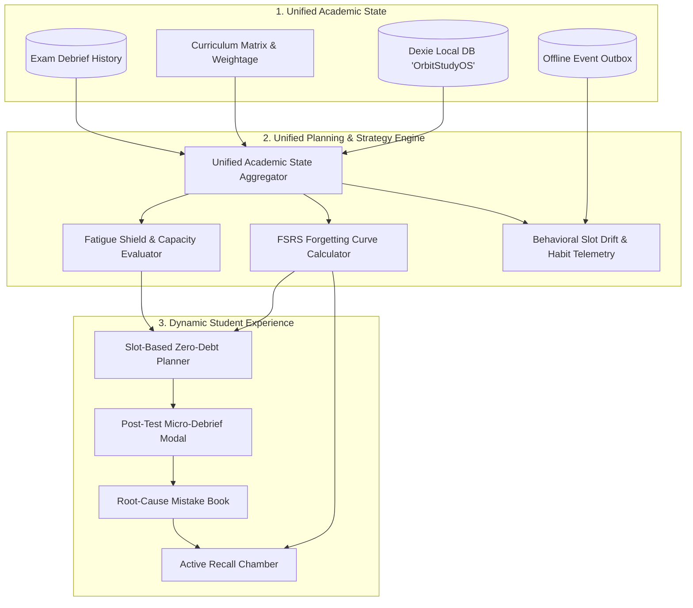

# Orbit v2 Architectural Audit & "Academic OS" Roadmap

**System**: Orbit Web v2  
**Philosophy**: *"Plan Less. Optimize Learning. Stay in Orbit."*  
**Scope**: End-to-end evaluation of data structures, planning algorithms, local-first state, cognitive feedback loops, post-test analytics, and behavioral telemetry.

---

## 1. Executive Summary

Orbit v2 is an intelligent **Adaptive Academic Operating System** built on a dual-layer local-first architecture (Next.js 14 App Router, Dexie.js IndexedDB, Supabase PostgreSQL). It replaces fragmented to-do apps with a closed-loop system that unifies daily mission execution, cognitive fatigue protection, adaptive spaced repetition (FSRS), structured error taxonomies, post-test diagnostic debriefs, and behavioral habit telemetry.

```
                      ┌─────────────────────────────────────────┐
                      │          USER / CLIENT SURFACE          │
                      │    Next.js 14 (App Router) + PWA UI     │
                      └────────────────────┬────────────────────┘
                                           │
                                           ▼
      ┌─────────────────────────────────────────────────────────────────────────┐
      │                    UNIFIED ACADEMIC MEMORY ENGINE                       │
      │                     (src/lib/academicState.ts)                          │
      ├────────────────────┬────────────────────┬───────────────────────────────┤
      │                    │                    │                               │
      ▼                    ▼                    ▼                               ▼
┌───────────────┐  ┌───────────────┐  ┌───────────────────┐           ┌───────────────────┐
│ FATIGUE SHIELD│  │ FSRS RETENTION│  │  ERROR TAXONOMY   │           │ POST-TEST DEBRIEF │
│ & CAPACITY    │  │    ENGINE     │  │  & AUTO-REVISION  │           │ & EXAM ANALYTICS  │
│ (Sleep/Energy)│  │(SM-2 Adaptive)│  │ (Root-cause Tag)  │           │(Subject Breakdown)│
└───────┬───────┘  └───────┬───────┘  └─────────┬─────────┘           └─────────┬─────────┘
        │                  │                    │                               │
        └──────────────────┴────────────────────┼───────────────────────────────┘
                                                │
                                                ▼
                     ┌──────────────────────────────────────────────┐
                     │            DUAL PERSISTENCE LAYER            │
                     ├──────────────────────────────┬───────────────┤
                     │   LOCAL-FIRST (0ms Latency)  │  CLOUD SYNC   │
                     │      IndexedDB / Dexie       │   Supabase    │
                     │      ('OrbitStudyOS')        │  (Postgres)   │
                     └──────────────────────────────┴───────────────┘
```

---

## 2. In-Depth Component Audit

### A. Planning Engine (`src/lib/planningEngine.ts`)

| Feature | Production Implementation | Architectural Evaluation |
| :--- | :--- | :--- |
| **Data Source** | Reads live state via `getUnifiedAcademicState()` (`src/lib/academicState.ts`). | **Closed-Loop:** Ingests live chapter confidence scores, unresolved mistake tallies, nearest exam dates, and recent sleep/energy logs directly from local Dexie. |
| **Priority Formula** | $\text{Score} = (W_{\text{exam}} \times \Delta_{\text{confidence}} \times \text{Urgency}) + \text{Penalty}_{\text{mistakes}} + \text{Decay}_{\text{forgetting}}$ | **ROI-Optimized:** Balances high-weight curriculum chapters, mistake penalty dampening, and memory stability decay. |
| **Energy & Capacity** | Proactive Fatigue Shield scales daily hours: $<6\text{h}$ sleep or $\le 2/5$ energy caps daily target to $\le 4.0\text{h}$. | **Burnout Protection:** Automatically throttles heavy conceptual blocks and shifts to low-friction active recall. |
| **Slot Allocation** | Morning (Hard problem), Afternoon (Core work), Evening (Spaced revision), Night (Review). | **Cognitive Alignment:** Matches task strain to circadian focus capacity with dynamic slot reassignment. |

---

### B. Structured Academic Memory & Offline Storage (`src/lib/db.ts`)

| Area | Production Implementation | Architectural Evaluation |
| :--- | :--- | :--- |
| **Dexie Schema** | Tables for `tasks`, `mistakes`, `revisions`, `exams`, `progress`, `reflections`, `events`, and `test_attempts`. | Complete local schema indexing keys (`user_id`, `scheduled_date`, `attempt_date`, `event_type`). |
| **Hybrid Persistence** | Instant local writes (0ms latency) backed by asynchronous, resilient Supabase synchronization. | Non-blocking, fault-tolerant design with schema fallbacks for older cloud database configurations. |
| **Zero-Loss Guarantee** | Full encrypted JSON backup export and import (`exportOrbitBackupJSON`, `importOrbitBackupJSON`). | Student state is completely portable across devices with 1-click snapshot restore. |

---

### C. Mistake Vault & Error Taxonomy (`src/api/mistakes.ts`)

| Aspect | Production Status | Architectural Evaluation |
| :--- | :--- | :--- |
| **Cognitive Taxonomy** | 5 Core Disciplines: `conceptual`, `calculation`, `careless`, `application`, `time_pressure`. | Forces students to diagnose the root symptom rather than passively reviewing notes. |
| **Difficulty Rating** | `easy`, `medium`, `hard`. | Stored and displayed with visual indicator chips. |
| **Closed-Loop Trigger** | Automatic Spaced Revision Enrollment. | Submitting a mistake automatically schedules the underlying chapter in the FSRS review queue. |

---

### D. Spaced Revision System (`src/lib/spacedRepetition.ts`, `src/api/revisions.ts`)

| Feature | Production Implementation | Target Alignment |
| :--- | :--- | :--- |
| **Algorithm** | Enhanced SM-2 / FSRS Memory Stability Model. | Dynamically computes optimal intervals based on recall grades (`Again`, `Hard`, `Good`) and ease factors. |
| **Error Penalty** | Dynamic interval compression for high-mistake chapters. | Reinforces fragile neural pathways before high-stakes exams. |
| **Planner Injection** | In-place Active Recall Chamber on `/planner`. | Students complete reviews directly on their daily desk in under 3 minutes. |

---

### E. Post-Test Debrief & Exam Analytics (`src/components/TestDebriefModal.tsx`, `src/api/testAttempts.ts`)

| Component | Production Implementation | Architectural Evaluation |
| :--- | :--- | :--- |
| **Diagnostic Flow** | 3-Step Micro-Debrief: Paper & Mindset $\rightarrow$ Syllabus & Leaks $\rightarrow$ Unfiltered Reflection. | Transforms raw test scores into actionable mistake and revision backlogs within 90 seconds. |
| **Exam Adaptability** | Single-Subject Tests vs. Multi-Subject Composite Exams. | Automatically shows accurate syllabus chapters without cross-track or cross-subject mismatch. |
| **Fumble Factor Analysis** | Categorizes slips into `concept_blindspot`, `time_panic`, `silly_slips`, or `in_control`. | Provides objective root-cause data for strategic review. |

---

## 3. The Closed-Loop Feedback Architecture



---

## 4. Phase-by-Phase Implementation Roadmap

### Phase 1: Real-State Aggregator & Dynamic Planning Pipeline ✅
- [x] Create `src/lib/academicState.ts`: Queries Dexie for unified chapter mastery, active mistake counts, nearest exams, and energy metrics.
- [x] Connect `planningEngine.ts` to `getUnifiedAcademicState()` so recommendations reflect real student data.
- [x] Update `AiMentorCard.tsx` to display real diagnostics (actual weak areas, real planned load, genuine exam countdowns).

### Phase 2: Smarter Exam Weightage & ROI Priority Scoring ✅
- [x] Add `weightage` and `tier` (High / Core / Ancillary) to `curriculumData.ts` for JEE (Physics/Chem/Math) and CS (DSA/ML/Systems).
- [x] Update priority algorithm with weightage-adjusted Expected Return per Study Hour.
- [x] Factor in mistake types: `conceptual` mistakes yield deep review blocks; `calculation` mistakes yield timed speed tests.

### Phase 3: Adaptive Spaced Revision & Auto-Scheduling ✅
- [x] Implement FSRS / SuperMemo-style review scheduler with memory stability scoring.
- [x] Auto-populate due spaced revisions directly into the planner's Evening slot with 3-grade recall chamber (`Again`, `Hard`, `Good`).

### Phase 4: Cognitive Energy & Anti-Burnout Intelligence ✅
- [x] Connect Daily Reflection outputs (sleep, energy, blockers) to dynamically scale daily capacity.
- [x] Add proactive mentor warnings and automatic study load throttling when sleep or energy is critically low.

### Phase 5: Cross-Device State Synchronization & PWA Hardening ✅
- [x] **Universal RFC 4122 v4 UUID Compliance (`src/lib/uuid.ts`):** Standardized all entity ID generation across tasks, exams, mistakes, and revisions, resolving PostgreSQL type mismatches.
- [x] **Automated Bi-Directional Reconciliation (`src/lib/syncService.ts`):** Automatic migration engine that pushes local offline mutations to Supabase and pulls remote updates down to client Dexie storage upon login.
- [x] **Starter Task Firewall:** Enforces strict boundary between unauthenticated mock demo tasks and persistent user data, eliminating zombie task resurrection.
- [x] **Cross-Device Curriculum & Deletion Sync:** Propagates user-hidden subjects and custom disciplines across devices using Supabase `event_log` preference streaming.
- [x] **Single-Execution Sync Guards:** Prevents screen flickering and redundant re-render cascades using idempotent lifecycle references (`hasInitializedRef`, `hasSyncedRef`).
- [x] **Drift-Proof Focus Engine & Screen WakeLock (`src/components/FocusTimerModal.tsx`):** Mitigates mobile background tab throttling via timestamp-delta calculation ($\Delta t = \text{Date.now()} - t_{\text{start}}$) and prevents device sleep during deep work sessions using the W3C Screen WakeLock API.
- [x] **Test Milestone Lifecycle & Edit Capabilities (`src/app/week/page.tsx`, `src/components/EditExamModal.tsx`):** Eliminated sample exam resurrection on page reload for authenticated users (`getHiddenSampleExams`), and introduced full modal-based test editing with bidirectional Dexie-Supabase sync.

### Phase 6: Academic Focus Track Integrity & Cross-Tab Connectivity ✅
- [x] **Signup-Only Track Configuration:** Track selection is strictly bound to initial account onboarding (`/login`). Removed all interactive track-switching buttons from `/profile` to prevent accidental syllabus corruption.
- [x] **Automatic Track Auto-Recovery (`src/app/journey/page.tsx`):** Added proactive track self-healing that detects custom CS & AI subjects and automatically restores `college_cs_aiml` if an accidental toggle occurred.
- [x] **Dual Name & ID Deletion Shield:** Enhanced `deleteSubject` and `getSubjectProgress` to filter hidden/deleted subjects by both database UUID and lowercased name, guaranteeing default seed subjects never leak into customized student profiles.
- [x] **Cross-Tab Deep Linking:** Full bidirectional links between Planner tasks, Journey chapter dossiers, and Mistake Vault entries.

### Phase 7: Universal Telemetry, Post-Test Debrief & Resilient Offline Sync Hardening ✅
- [x] **Interactive Post-Test Micro-Debrief Engine (`src/components/TestDebriefModal.tsx`, `src/api/testAttempts.ts`):**
  - Butter-smooth 3-step modal auto-triggered upon checking off mock tasks or via the Exam Card action button.
  - Automatic adaptation for Single-Subject tests vs. Multi-Subject composite exams.
  - Deep analysis capturing paper difficulty (*Easy, Balanced, Crushing*), fumble factor (*Concept blindspot, Time panic, Calculation slips, In control*), relative peer difficulty, per-subject scoring, and leaked chapter tagging.
  - Dedicated unfiltered student notes area (`student_notes`) for raw qualitative debrief notes without friction.
  - Direct automated mistake creation linking leaked chapters to the Mistake Vault and FSRS revision queue.
- [x] **Subject-First Exam Creation & Editing Flow (`AddExamModal.tsx`, `EditExamModal.tsx`):**
  - Progressive disclosure: test name $\rightarrow$ select participating subjects with clickable badges $\rightarrow$ tabbed chapter syllabus view displaying only selected subjects.
  - Eliminates clutter and prevents syllabus chapter mismatch on exams.
- [x] **Offline-First Behavioral Telemetry Engine (`src/lib/telemetry.ts`, `src/api/events.ts`):**
  - Outbox pattern in Dexie (`db.events`) with automatic cloud flush to Supabase `event_log`.
  - Captures rich temporal context: slot drift, date drift, advance planning ratio, focus duration, and execution latency.
  - India Digital Personal Data Protection (DPDP) Act compliance with privacy disclosure and local self-containment.
- [x] **Structured AI Mentor Context Pipeline (`src/lib/aiMentorContext.ts`):**
  - Deterministic `buildAiMentorContext()` payload aggregating student velocity, subject breakdown scores, fatigue history, and test insights for future LLM mentor integrations.
- [x] **Universal Streak Accuracy & Non-Destructive Sync (`src/api/gamification.ts`, `src/lib/syncService.ts`, `src/api/tasks.ts`, `src/lib/db.ts`):**
  - Preserves both `scheduled_date` and `completed_at` in daily completion sets, guaranteeing consecutive streaks (4-day, 10-day, 30-day+) never collapse from batch completions or timezone shifts.
  - Spaced revisions and mock test attempts also contribute to daily streak continuity.
  - Removed destructive local task purges during background sync.
  - Added automatic core schema fallbacks to cloud task operations (`createTask`, `closeTask`, `rescheduleTask`, `getTasksForDate`), preventing failures on databases without telemetry columns.
  - Relaxed user ID matching in `getLocalTasksForDate` to bridge guest (`local-user`) and authenticated sessions.
  - Extended profile gamification query timeouts from 1s to 6s for mobile connection resilience.

---

## 5. Architectural Quality Matrix

| Dimension | MVP Status | Current v2 Production State |
| :--- | :--- | :--- |
| **Offline Resilience** | Fragile (silent failure on type error) | 100% Dual-layer (Dexie 0ms cache + RFC 4122 Supabase sync + Schema fallbacks) |
| **Cross-Device Parity** | 0% (Data trapped in local browser storage) | 100% (Bidirectional cloud reconciliation across phone & PC) |
| **Streak Engine** | Collapsed on batch completion or timezone change | 100% Universal Multi-Signal Engine (Scheduled dates + Completion timestamps + Revisions + Tests) |
| **Task Data Safety** | Vulnerable to sync-purge if cloud delayed | 100% Non-destructive offline-first storage; local tasks never purged during sync |
| **Post-Test Debrief** | 0% (No test diagnostic mechanism) | 100% Interactive 3-Step Micro-Debrief (Single vs. Multi-Subject, Fumble analysis, Notes, Auto-mistake sync) |
| **Exam Creation Flow** | Clustered all-chapter dropdown | 100% Progressive Subject-First Selection + Tabbed Syllabus View |
| **Sample Task Isolation** | Leaked into persistent account state | Firewalled (`isStarterTask` filter + auto-purge on sync) |
| **Deep Work Fidelity** | Timer froze on phone lock/timeout | Drift-proof timestamp delta + W3C Screen WakeLock keep-alive |
| **Curriculum Customization** | Siloed to device `localStorage` | Cloud-persisted (Custom tables + `event_log` preference streaming) |
| **Track Boundary Integrity** | Interactive switcher caused syllabus desync | Locked to signup onboarding; read-only badge in app; auto-recovery engine |
| **Behavioral Telemetry** | None | Offline-first event stream tracking slot drift, date drift, and DPDP compliance |
| **AI Mentor Readiness** | Hardcoded static strings | Deterministic `buildAiMentorContext()` payload contract ready for LLM mentor integration |
| **Cross-Tab Linkage** | Siloed pages requiring manual navigation | Full bidirectional deep linking between Planner, Journey, Mistake Vault & Exam Radar |
